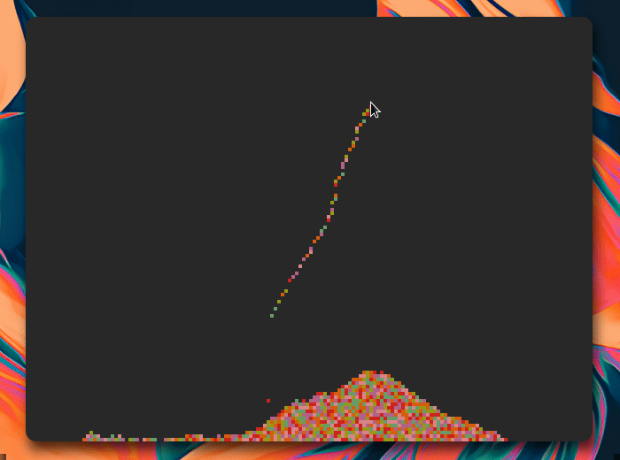

# sand++
 
C++ physics sand pixel simulator. Inspired by the video game Noita. Utilizes the SDL 2.0 library.
 

 
### Compiling and Running

```bash
$ ./compile.sh
$ ./main
```

### Controls
 
Left mouse to create sand; right mouse to delete.
